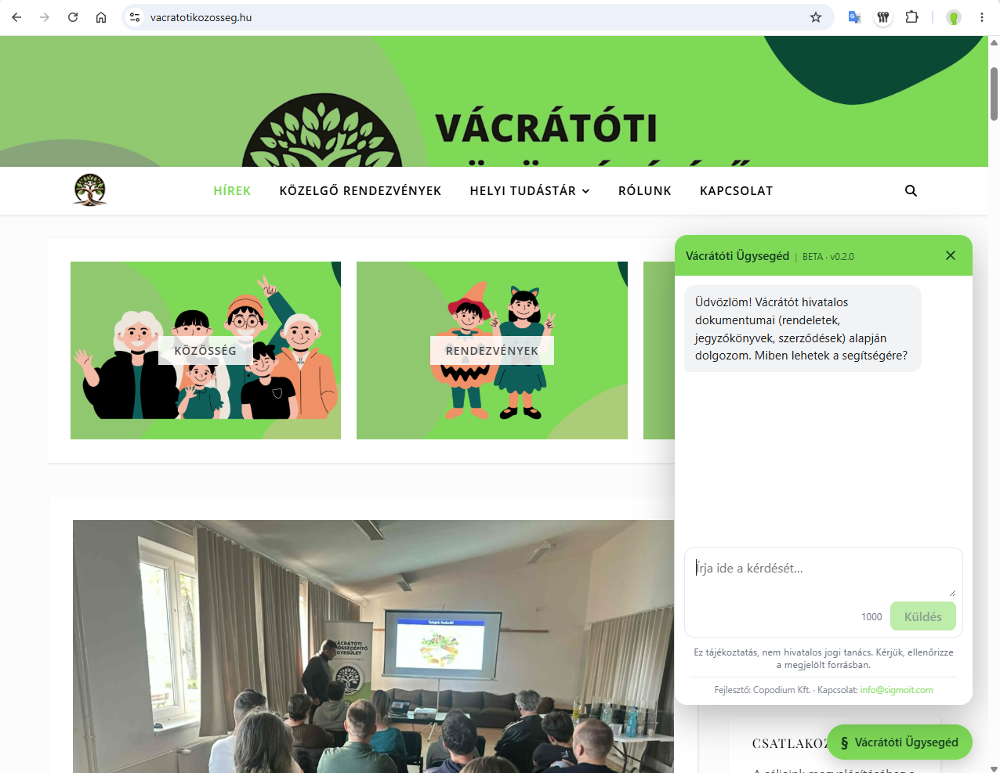
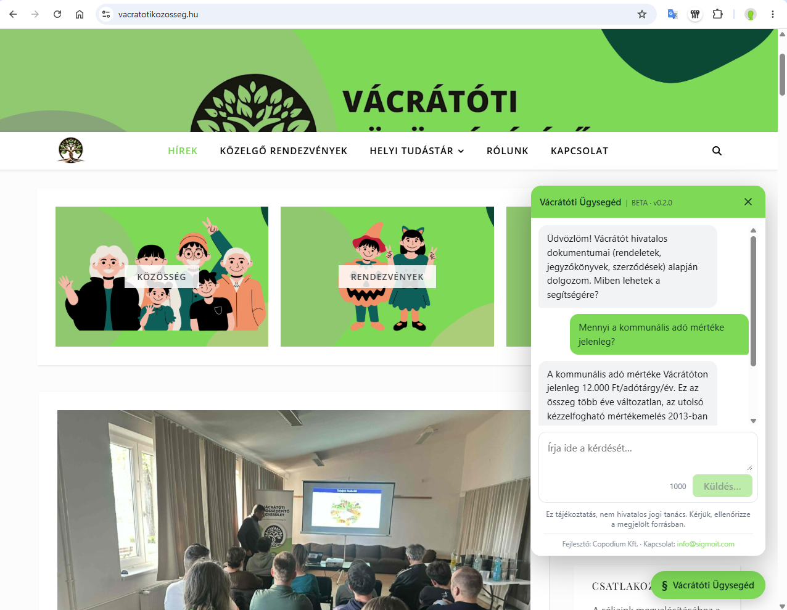
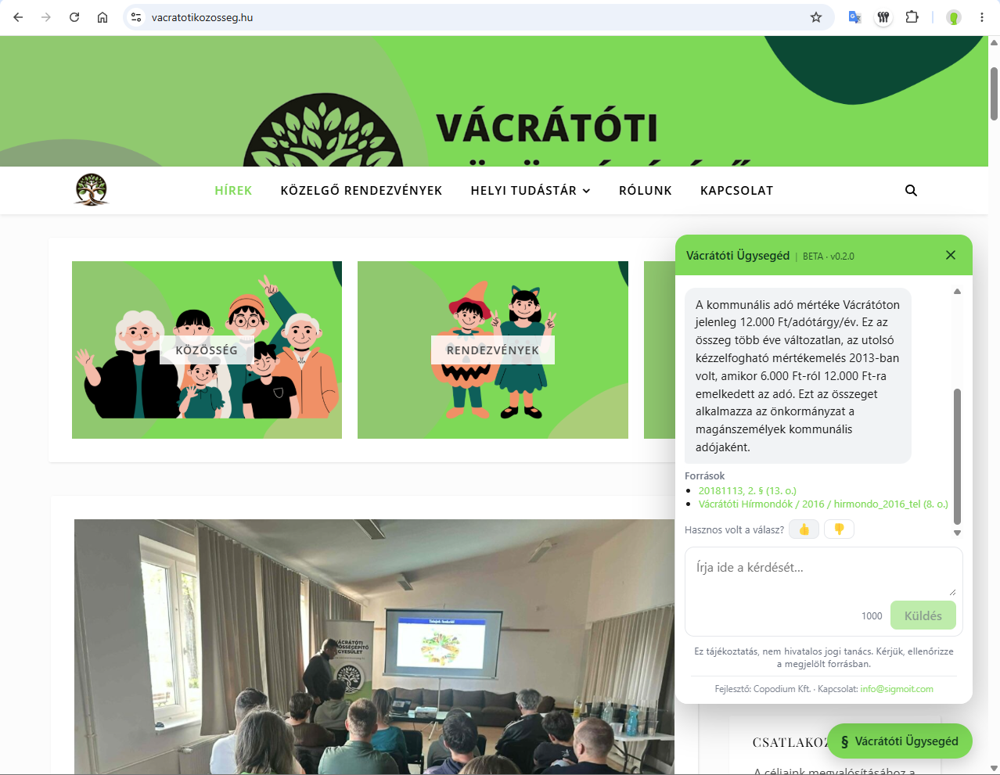
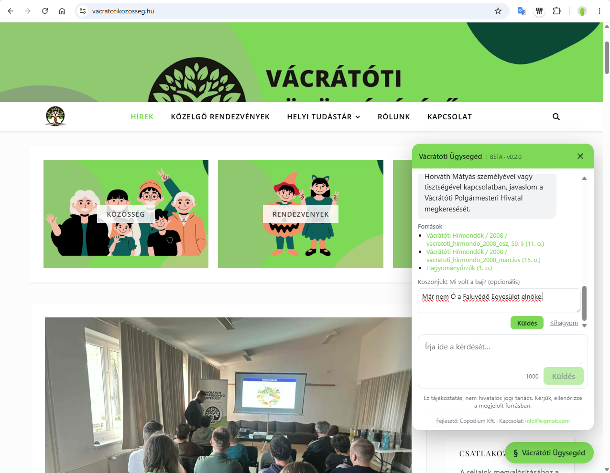

> [English](README.md) · **Magyar**

# Önkormányzati Ügysegéd (`municipal-assistant`)

**🟢 Élő demó:** **https://ugyseged.vacratotikozosseg.hu** — MVP / showcase. Az aktív termékfejlesztés privát repóban folytatódik.

> **A projektről.** Production-jellegű, magyar nyelvű RAG-asszisztens, végponttól végpontig
> **AI-augmented delivery**-ként építve: egy önkormányzat **hivatalos dokumentumai alapján**,
> forrásmegjelöléssel és „nem tudom" guardraillel válaszol. A lényeg a forrás-adapterekben
> (visszafejtett WordPress Document Library Pro admin-ajax, Nemzeti Jogszabálytár, nyilvános
> Google Drive), a szkennelt jegyzőkönyvek magyar OCR-jében, és a hibrid + rerankelt
> keresésben, mért before/after bizonyítékkal hangolva. A mérnöki döntések menet közben
> dokumentálva — lásd **[docs/DECISIONS.md](docs/DECISIONS.md)** (ADR-lite, kompromisszumokkal
> és ismert korlátokkal), **[docs/ARCHITECTURE.md](docs/ARCHITECTURE.md)** (felépítés + egy
> kérdés útja a kódon át), **[docs/RETRIEVAL_NOTES.md](docs/RETRIEVAL_NOTES.md)** (before/after
> keresés-mérés). A specifikáció: [docs/BRIEF.md](docs/BRIEF.md); a commit-történet kis lépéses,
> PR-review-zott, AI-páros munkafolyamatot tükröz.

Beágyazható chat-webalkalmazás, amely egy önkormányzat **hivatalos dokumentumai
alapján**, forrásmegjelöléssel válaszol a lakosok kérdéseire. A háttérben RAG
(retrieval-augmented generation) fut hibrid kereséssel (PostgreSQL + `pgvector`
szemantikus + magyar full-text).

A termék **bérlő-agnosztikus**; minden településspecifikus dolog két „varrat" mögé
kerül: a `DocumentSource` adapter (forrás-felfedezés/letöltés) és a `TenantConfig`
(arculat, források, RAG-paraméterek). Az **MVP bérlő: Vácrátót**.

## Képernyőképek

A befogadó oldalon lebegő widgetként beágyazva, sorrendben:

<table>
  <tr>
    <td width="50%"><br><sub><b>1. Lebegő widget — üdvözlés</b></sub></td>
    <td width="50%"><br><sub><b>2. Kérdés feltevése (streamelt)</b></sub></td>
  </tr>
  <tr>
    <td width="50%"><br><sub><b>3. Forrásmegjelölt válasz + 👍/👎</b></sub></td>
    <td width="50%"><br><sub><b>4. 👎 opcionális kommenttel</b></sub></td>
  </tr>
</table>

## Funkciók

- **Hibrid keresés:** szemantikus (pgvector) + magyar full-text (GIN) RRF-fúzióval és
  frissesség-súlyozással, plusz egy **garantált hiteles-shortlist** és egy
  **tekintély-tudatos LLM-rerank** (lásd [docs/RETRIEVAL_NOTES.hu.md](docs/RETRIEVAL_NOTES.hu.md)).
- **Guardrailek:** `minScore` küszöb alatt „nem tudom" válasz, kötelező
  forrásmegjelölés, jogi disclaimer, IP-alapú rate limit, CORS + CSP `frame-ancestors`.
- **Forrás-adapterek** (varrat #1): `manual-upload`, `dlp-library` (kurált WordPress
  Document Library Pro), `njt-decrees` (hatályos rendeletek + indokolás + mellékletek a
  Nemzeti Jogszabálytárból), `google-drive` (nyilvános üvegzseb-mappa) és
  `wordpress-pages` (hivatali/szolgáltatási oldalak).
- **Szkennelt PDF → magyar OCR** (`tesseract.js`, lokális, nincs rendszerfüggőség).
- **Beágyazható lebegő chat-widget** — egyetlen `<script>` tag, lustán töltött iframe,
  arculat/színek/ikon a `TenantConfig`-ból.
- **👍/👎 visszajelzés** opcionális kommenttel, a `query_log`-ba mentve az **idézett
  forrásokkal** együtt, kézi minőség-ellenőrzéshez.
- **SSE-streamelt válaszok**; Angular 21 (signalek) UI.
- **Deploy:** Hetzner + Docker Compose + Caddy (automatikus HTTPS) + GitHub Actions
  CI/CD (build → GHCR → SSH deploy).

## Monorepo felépítés (npm workspaces)

```
municipal-assistant/
├─ shared/      # bérlő-agnosztikus típusok (DTO-k, DocumentSource, TenantConfig)
├─ config/      # config-betöltő + tenantok (varrat #2)  — config/tenants/vacratot.ts
├─ backend/     # Express API, ingestion pipeline, DB, RAG, OCR
└─ frontend/    # Angular 21 chat UI (lebegő widgetként ágyazható)
```

## Előfeltételek

- Node.js **>= 20.19**, npm **>= 10**
- Docker (a lokális Postgres + pgvector miatt)
- OpenAI API kulcs

## Beüzemelés

```bash
# 1) Függőségek
npm install

# 2) Környezeti változók
cp .env.example .env       # majd töltsd ki (legalább OPENAI_API_KEY)

# 3) Adatbázis (Postgres + pgvector dockerben)
npm run db:up

# 4) Séma migrálása
npm run migrate
```

### Titkok

Az OpenAI kulcs **kizárólag** a `.env`-ből (`OPENAI_API_KEY`) jön — soha nem kerül
kódba vagy a tenant-configba. A `.env` a `.gitignore`-ban van; csak a `.env.example`
verziózott.

## Futtatás

```bash
# Dokumentumok betöltése a helyi data/uploads mappából (manual-upload adapter)
npm run seed

# Vagy az összes konfigurált forrás újraindexelése
npm run reindex

# Backend dev szerver (SSE /api/ask)
npm run dev
```

### Gyors teszt

1. Tegyél néhány PDF-et a `data/uploads/` mappába.
2. `npm run seed` — betölti, darabolja, embeddeli és upsertálja őket.
3. `npm run dev`, majd:

```bash
curl -N -X POST http://localhost:3001/api/ask \
  -H 'Content-Type: application/json' \
  -d '{"question":"Mennyi a kommunális adó?"}'
```

A válasz **SSE** stream: `token` események a szövegre, a végén egy `sources`
esemény a forrásokkal, majd `done`.

## Források (adapterek, varrat #1)

- **`manual-upload`** — helyi mappából (`data/uploads/`) olvas PDF/TXT fájlokat.
  Fájlonként opcionális `<fájlnév>.meta.json` (`title`, `category`, `sourceUrl`,
  `publishedAt`) felülírhatja a metaadatot. A leggyorsabb úton tesztelhető vele a
  teljes pipeline. Indítás: `npm run seed`.
- **`dlp-library`** — a `vacratot.hu/dokumentumok` **kurált Document Library Pro**
  listája (a kanonikus forrás). Az oldalról frissen kiolvasott nonce-szal hívja az
  `admin-ajax.php` `dlp_fetch_table` végpontot **kategóriánként** (mappánként), és a
  válasz teljes tábláját parse-olja (cím, fájl-URL, **valódi DLP-kategória**),
  beleértve a **külső linkes** tételeket (pl. njt/Drive). Felváltja a régi
  `wp/v2/media` megoldást: nincs médiakönyvtár-zaj, valódi kategóriák, és a
  heurisztikára sincs szükség (`trustCategory`). A szkennelt PDF-ek itt is OCR-t
  kapnak. (A régi `wordpress-accordion` adapter a registryben marad, de a Vácrátót
  config már a `dlp-library`-t használja.)
- **`njt-decrees`** — a **hatályos** önkormányzati rendeletek **hiteles
  forrása** a Nemzeti Jogszabálytárból (`njt.jog.gov.hu`). A „csak hatályos"
  szűrt listanézetet lapozza (szerver-renderelt HTML), és a rendeletoldal
  §-tudatos szövegét nyeri ki. A rendelet **melléklet-PDF-jeit** (díjtáblák,
  költségvetés) is letölti és kinyeri/OCR-ezi (`includeAttachments`,
  `ocrAttachments`). A forrást idézi + njt-re linkel vissza, nem közli újra.
  Az `options.authoritativeFor: ['rendeletek']` miatt sikeres betöltés után
  **felülírja** (`superseded`) a többi forrás (pl. a vacratot.hu szkennelt)
  `rendeletek` dokumentumait. **Megjegyzés:** az njt rate-limitel; az adapter
  udvarias késleltetéssel dolgozik. (Egyes hálózatokról az njt blokkolhatja az
  automata kéréseket — a betöltés onnan fut, ahonnan az njt elérhető.)

> **Költség/idő:** az embedding (`text-embedding-3-small`) költsége elhanyagolható
> (centek), az OCR lokális (ingyenes). A `reindex` fő „ára" az **idő**: sok PDF
> udvarias késleltetéssel + OCR-rel akár több tíz perc. Fejlesztéshez a
> `seed` (manual-upload) a gyors út.

**Szkennelt PDF-ek (OCR):** ahol nincs kinyerhető szövegréteg (szkennelt kép),
a pipeline a **Tesseract (magyar) OCR-t** futtatja (`tesseract.js` + PDF→PNG
render `@napi-rs/canvas`-szal — nincs rendszerszintű függőség). A cél a
**kereshetőség és idézhetőség**, nem a tökéletes átirat: aláírt/pecsétes/ferde
szkenneknél a szöveg zajos lehet. Kapcsolók: `OCR_ENABLED`, `OCR_MAX_PAGES`,
`OCR_VIEWPORT_SCALE` (lásd `.env.example`).

Ha az OCR is üres eredményt ad (vagy `OCR_ENABLED=false`), a dokumentum
`status='needs_ocr'` jelölést kap chunk nélkül — kereshetetlen marad, de
nyomon követhető és bármikor re-indexelhető (a nem-`active` dokumentumokat a
betöltés mindig újrafeldolgozza). Listázás:
`SELECT external_id, title FROM documents WHERE status = 'needs_ocr';`

**Kategorizálás:** a dokumentum kategóriáját a betöltés a **tartalomból**
(kinyert/OCR-ezett szöveg) állapítja meg, nem a fájlnévből — a `TenantConfig`
`categoryKeywords` (kategória-kulcsonkénti, sorrend = prioritás) kulcsszavai
alapján, a kategória-címkékből képzett tartalékkal. A már betöltött dokumentumok
újrakategorizálása (re-fetch/embed nélkül): `npm run recategorize`.

## Frontend (Angular 21 chat UI)

Minimális, beágyazható chat-felület (BRIEF 7. pont): üdvözlő üzenet, streamelt
válasz, kattintható források, jogi disclaimer. A brandinget a backend
`GET /api/config` végpontjáról tölti (varrat #2 tisztán marad).

```bash
# 1) A backendnek futnia kell (másik terminálban: npm run dev)
# 2) Angular dev szerver — a /api hívásokat a backendre proxyzza (localhost:3001)
npm run dev:frontend
```

A dev szerver a `http://localhost:4200` címen érhető el. A `/api/*` kéréseket a
[frontend/proxy.conf.json](frontend/proxy.conf.json) irányítja a backendre, így
nincs CORS-gond fejlesztés közben.

**Build:** `npm run build -w frontend` → statikus fájlok a `frontend/dist/`-ben.

### Beágyazás (lebegő widget)

A backend egy önálló betöltőt szolgál ki a `/widget.js`-en. Egyetlen sor a befogadó
oldalra (pl. WordPress fejléc/lábléc szkript-plugin, site-wide):

```html
<script src="https://<host>/widget.js" defer></script>
```

Lebegő gombot rajzol (jobb alsó sarok), ami panelben, iframe-ben nyitja a chatet — az
iframe **csak az első megnyitáskor** jön létre, így nem lassítja a befogadó oldalt. A
gomb felirata, címe, színei és ikonja a `TenantConfig`-ból jön.

> A `TenantConfig.embed.allowedOrigins` (CORS + CSP `frame-ancestors`) szabályozza,
> mely oldalak ágyazhatják be. Lásd: [docs/DEPLOY.md](docs/DEPLOY.md).

## Hasznos parancsok

| Parancs                             | Mit csinál                              |
| ----------------------------------- | --------------------------------------- |
| `npm run db:up` / `npm run db:down` | Lokális Postgres indítása/leállítása    |
| `npm run migrate`                   | DB séma létrehozása/frissítése          |
| `npm run seed`                      | Betöltés a `manual-upload` adapterrel   |
| `npm run reindex`                   | Az összes konfigurált forrás betöltése  |
| `npm run recategorize`              | Meglévő dokumentumok újrakategorizálása |
| `npm run dev`                       | Backend dev szerver                     |
| `npm run dev:frontend`              | Angular dev szerver (proxyval)          |
| `npm run build -w frontend`         | Frontend production build               |
| `npm run lint` / `npm run format`   | Lint / formázás (backend csomagok)      |
| `npm run typecheck`                 | Típusellenőrzés (shared/config/backend) |

## API

| Végpont             | Leírás                                             |
| ------------------- | -------------------------------------------------- |
| `POST /api/ask`     | RAG válasz SSE-streamként (token → sources → done) |
| `GET /api/health`   | Készenléti ellenőrzés                              |
| `GET /api/config`   | Tenant branding + limitek a UI-nak                 |
| `POST /api/reindex` | Védett (Bearer `REINDEX_TOKEN`) kézi betöltés      |
